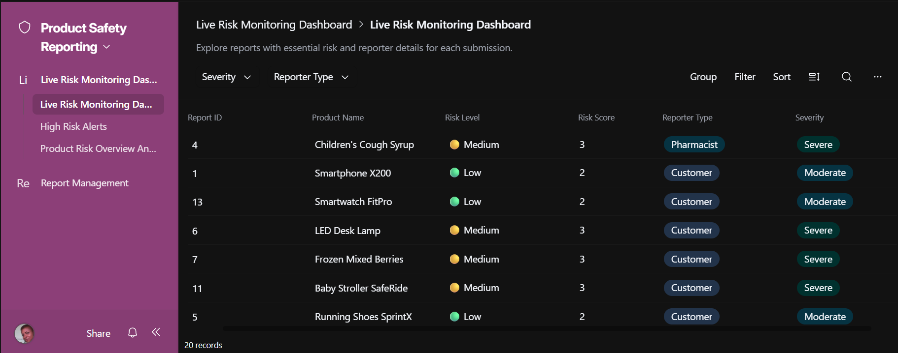
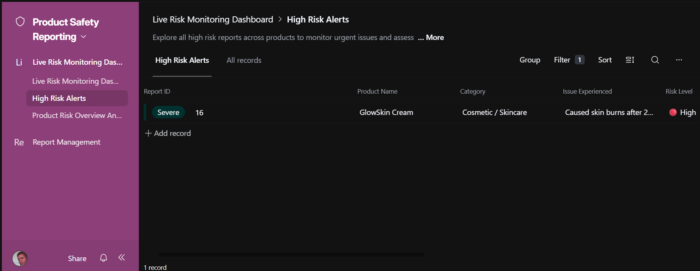
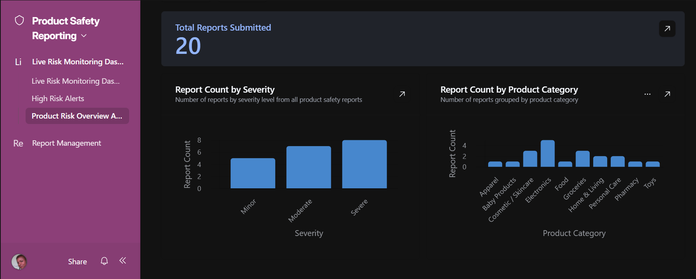
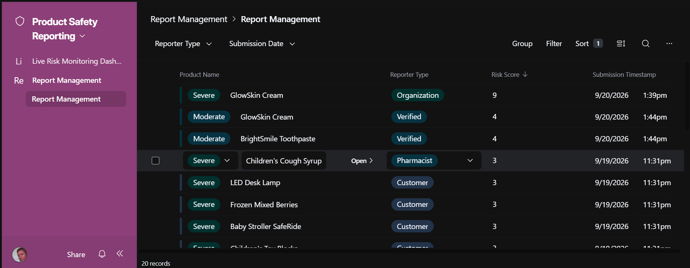
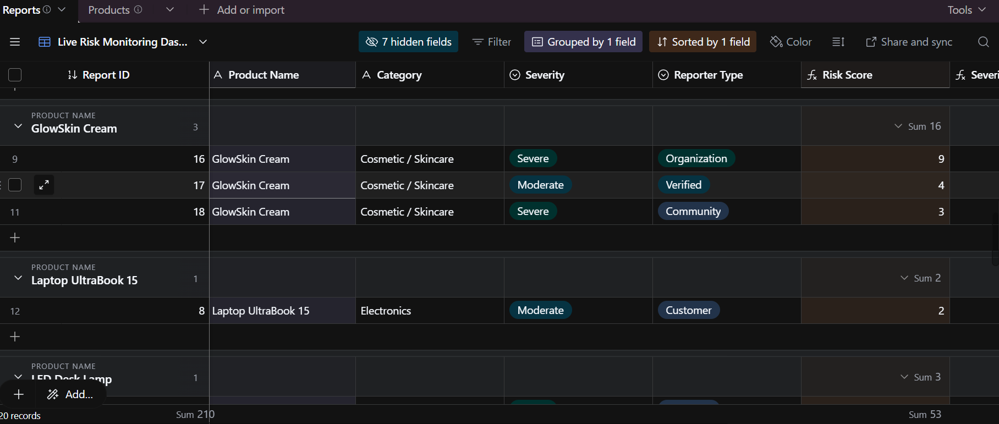
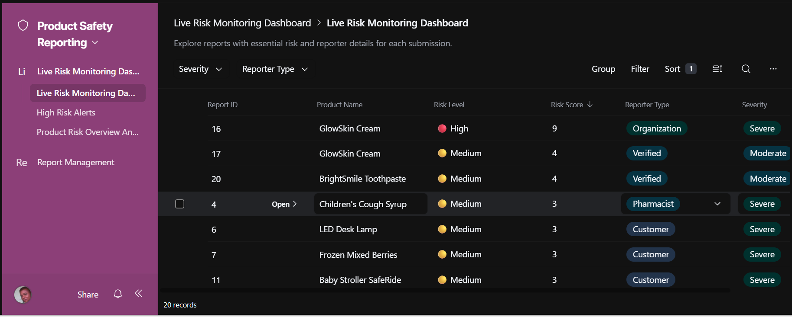

# 🧠 ProductPulse

ProductPulse is an AI-powered product safety reporting and monitoring system that transforms individual user reports into actionable risk insights for communities and regulators.

---

## 🚨 Problem

Many harmful or counterfeit products go undetected because:
- Reports are scattered across informal channels  
- No structured tracking system exists  
- Authorities often react too late, after harm has already spread  

---

## 💡 Solution

ProductPulse enables:
- Real-time reporting of product issues  
- Trust-weighted risk scoring  
- Aggregation of reports into product-level intelligence  

By combining severity and credibility, the system identifies high-risk products early and supports faster, data-driven decision-making.

---

## ⚙️ How It Works

1. Users submit product safety reports  
2. The system evaluates:
   - Severity of the issue  
   - Reporter credibility  
3. A Risk Score is calculated  
4. Reports are aggregated across products  
5. High-risk products are flagged for attention  

---

## 🗄️ Data Structure (Backend)

ProductPulse is powered by a structured data model that captures and processes product safety reports.

Each report includes:
- Product Name  
- Severity Level (Minor, Moderate, Severe)  
- Reporter Type (Community, Verified, Organization)  
- Risk Score (calculated)  
- Submission Timestamp  

This structured schema enables:
- Consistent data collection  
- Risk scoring logic  
- Aggregation across reports  
- Real-time analytics and dashboards  

👉 View raw dataset:  
https://airtable.com/apphU5i8m1GuU4uc2/shrQKxDwFcBipZqnP/tblgWH7zMwmD7opdC/viwmF1hKViRsJf27O

---

## 🔢 Risk Model

**Risk Score = Severity Score × Trust Level**

### Severity Scale

| Severity | Score |
|----------|------|
| Minor    | 1    |
| Moderate | 2    |
| Severe   | 3    |

### Trust Levels

| Reporter Type | Trust |
|--------------|------|
| Community    | 1    |
| Verified     | 2    |
| Organization | 3    |

---

## 📊 Key Features

- Real-time reporting system  
- Trust-weighted risk scoring  
- Product-level aggregation  
- Risk monitoring dashboard  
- Analytics (severity and category trends)  

---

## 🏛️ Why This Matters

ProductPulse helps governments and regulatory bodies:
- Detect harmful products earlier  
- Identify patterns across categories and regions  
- Prioritize inspections and enforcement  
- Make evidence-based policy decisions  
- Strengthen the feedback loop between communities and institutions  

This shifts product safety from reactive responses to proactive intervention.

---

## 🧪 Proof of Concept

This project was built using:
- Airtable (database, logic, and interface)  
- AI tools (ChatGPT for system design and development support)  

---

## 📍 Future Improvements

- Geolocation tracking (identify high-risk regions)  
- AI-based fake product detection  
- Integration with regulatory systems  

---

## 🤖 Use of AI

AI tools were used to:
- Design the system architecture  
- Design the database schema  
- Develop the risk scoring logic  
- Structure workflows and reporting system  

AI enabled rapid development of a functional and scalable proof of concept.

---

## 🎥 Demo

Watch the full demo here:  

👉 https://youtu.be/Z5zk17AzDuE

---

## 🌐 Explore the Live System (Airtable Interface)

### 📊 Risk Monitoring Dashboard  
👉 https://airtable.com/apphU5i8m1GuU4uc2/shrZsDKbMKJGDrDd2  

---

### 🚨 High Risk Alerts  
👉 https://airtable.com/apphU5i8m1GuU4uc2/shrnzAQdsttDuAtOZ  

---

### 📈 Product Risk Analysis  
👉 https://airtable.com/apphU5i8m1GuU4uc2/shrVuMuLiotglA03A  

---

### 🗂️ Raw Reporting Data  
👉 https://airtable.com/apphU5i8m1GuU4uc2/shrQKxDwFcBipZqnP/tblgWH7zMwmD7opdC/viwmF1hKViRsJf27O  

---

💡 Note: If Airtable requires sign-in, the full walkthrough is available in the demo video.

---

## 📸 Dashboard Preview

### 📊 Risk Monitoring Dashboard

---

### 🚨 High Risk Alerts

---

### 📈 Product Risk Analysis

---

### 📋 Report Management

---

### 🔍 Grouped View

---

### ⚡ Sorted by Risk Score

---

## 🌍 Real-World Considerations

### 🔐 Trust & Verification
- Structured severity classification  
- Reporter credibility weighting  
- Aggregation across multiple reports  

---

### 📶 Low Bandwidth & Accessibility
- Lightweight system design  
- Minimal interaction required  
- Future support for SMS/USSD  

---

### ♿ Accessibility & Inclusion
- Clear visual indicators  
- Simple reporting workflows  

---

### 🔒 Privacy & Security
- No sensitive personal data required  
- Reporter identity abstracted  

---

### 🌍 Multilingual & Local Relevance
- Adaptable across regions  
- Supports multilingual deployment  

---

### 👉 Clear Next Steps

ProductPulse enables action by:
- Supporting inspections  
- Enabling product recalls  
- Driving targeted enforcement  
